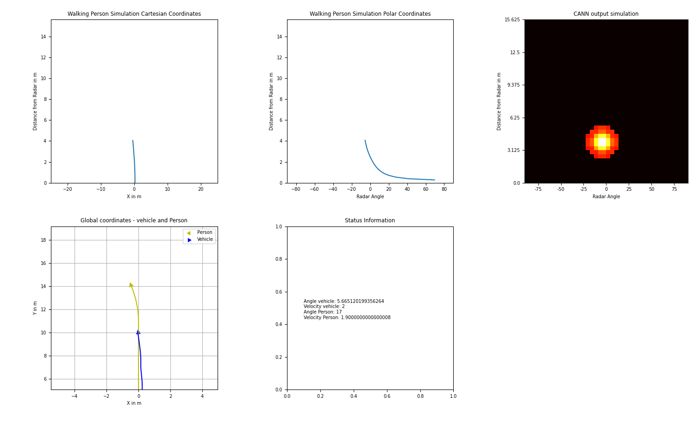

# Master Thesis Finn Capelle - A Spiking Neural Network Trained with R-STDP for Person Following Using FMCW Radar Data

The goal of this master thesis was to implement the driving algorithm for a person
following robot using Spiking Neural Networks.
The network receives tracking data from a CANN which was implemented in another master thesis.
The CANN gets its input data from a FMCW radar sensor. The description of the network and
results of different tests are described and visualized in the 4. and 5. chapter of the thesis.

The proposal can be found [here](https://www.ce.cit.tum.de/fileadmin/w00cgn/air/Thesis_Proposals/2022-03_Thesis_Dietrich-Robin_Radar-Person-Following.pdf). 
Contact:  
TUM E-Mail: ge34faj@mytum.de 
or: finncapelle@yahoo.de

## Software
This section describes the software in this repository.
The repository contains the SNN and the simulation environment in which the 
SNN was trained.
The software was implemented and tested in python 3.9.6. 

### Structure
The repository contains two packages. The first one is the **neural_network** which contains
the implemented SNN and the class to visualize the current state of the SNN and its
input and output spikes. 
The second one is the **simulation** which contains the environment in which the SNN was trained.
Here the person and robot movement are simulated and the CANN. The **Simulation** class combines
everything and provides methods, with which data for training can be accessed,
like the reward and input data. 
The **main.py** file can be seen as the entry point as it contains a function for testing
and training of the network, which should also be executed to run everything.

*Visualtization of the Simulation Environment*

*Visualtization of the SNNs input, output and internal state*

### Dependencies 
These are the dependencies which are needed for the network and simulation environment:

> <ul>
>   <li>brian2 2.5.1</li>
>   <li>scipy 1.9.3</li>
>   <li>numpy 1.23.4</li>
>   <li>matplotlib 3.6.1</li>
> </ul>

If only the SNN is required, the following dependencies are needed:

> <ul>
>   <li>brian2 2.5.1</li>
>   <li>numpy 1.23.4</li>
> </ul>

### Configuration File
The **config.ini** file contains all the parameters which can be changed in the
simulation environment and the relevant parameters for synapses and neurons in the
SNN. 

> - `[setup]`
>   - `train: false` set to true/false if the network should be trained
>   - `test: true` set to true/false if the network should be tested
>   - `evaluate: false` set to true/false if the network should be evaluated
>   - `test_steps: 6000` number of simulation steps for testing
>   - `evaluate_scenario: 1` the scenario which should be evaluated (see thesis section 5)
>   - `starting_pos_person_radius: 4.0` starting position person in meters
>   - `starting_pos_person_angle: 0.0` starting position person in degrees [-90, 90]
>   - `show_simulation_visualization: true` true if the simulation should be visualized
>   - `simulation_visualization_update_rate: 1` update rate for the simulation visualization, corresponds to steps
>   - `show_snn_visualization: true` true if the snn state and output should be visualized
>   - `snn_visualization_update_rate: 1` update rate for the snn visualization, corresponds to steps
> 
> - `[robot]` Parameters for the robot
>   - `width: 0.4` in meters
>   - `max_angle_velocity: 0.2` the maximum angular velocity of the robot for one time step
>   - `max_velocity: 2` the max velocity of the robot in m/s
> 
> - `[person]` Parameters for the person simulation, can be changed during the simulation in code
>   - `person_velocity: 1` velocity of the person in m/s
>   - `turn_angle_time_step: 1` angle the person can turn in each time step in degrees 
>   - `turn_probability: 20` probability the person will make a turn in this step
>   - `min_wait_turn_steps: 20` minimum amount of steps to wait after a complete turn
>   - `min_turn_angle: 10` the minimum angle the person can turn before walking forward again
>   - `max_turn_angle: 20` the maximum angle the person can turn before walking forward again
>   - `fps: 10` number of frames per second from the FMCW radar --> `simulation_step_time`
>   - `change_angle = True` weather or not the person can change the walking angle
> 
> - `[CANN]`
>   - `number_neurons_x: 40` number neurons in angle direction min 6
>   - `number_neurons_y: 40` number neurons in radius direction min 6
>   - `ratio_radius: 0.390625` distance in meters covered by one neuron in y direction
>   - `ratio_angle: 4.5` angle in meters covered by one neuron in x direction
> 
> - `[simulation]`
>   - `simulation_step_time:  100` time for one simulation step in ms
>   - `desired_distance_person_x:  0` the angle distance the robot is trained to keep from the person
>   - `desired_distance_person_y:  4` the radius distance the robot is trained to keep from the person
> 
> - `[reward.cann]` reward for synapses connecting the CANN to velocity neurons
>   - `scaler_x:  0.000002` scaler for the reward in angle direction
>   - `scaler_y:  0.0001` scaler for the reward in radius direction
> 
> - `[reward.distance]` reward for synapses connecting the distance to velocity neurons
>   - `scaler:  0.005` scaler for the reward
> 
> - `[velocity.network]` values for the neurons and synapses in the network predicting the velocity
>   - `tau = 20.0` time of decay in ms
>   - `v_threshold = 100.0` threshold voltage in mV
>   - `v_reset = 0.0` reset voltage in mV
>   - `w_start = 10.0` initial weight for synapses connecting the CANN to velocity neurons in mV
> 
> - `[velocity.RSTDP]` R-STDP Constants for synapses connecting the CANN to velocity neurons
>   - `tau_pre = 20.0` STDP time constant for potentiation
>   - `tau_post = 20.0` STDP time constant for depression
>   - `w_min = -300.0` min weight for synapses in mV
>   - `w_max = 300.0` max weight for synapses in mV
>   - `c_min = 0.0` min value of eligibility trace in mV
>   - `c_max = 20.0` max value of eligibility trace in mV
>   - `dApre = 0.001` Amplitude of weight change for potentiation and depression 
>   - `tau_c = 500.0` time of decay for eligibility trace 
>   - `tau_r = 200.0` time of decay for reward
> 
> - `[distance.network]` values for the neurons and synapses in the network predicting the distance
>   - `tau = 20.0` time of decay in ms
>   - `v_threshold = 1.0` threshold voltage in mV
>   - `v_reset = 0.0` reset voltage in mV
>   - `w_start = 12.0` initial weight for synapses connecting the CANN to velocity neurons in mV
> 
> - `[distance.RSTDP]` R-STDP Constants for synapses connecting the distance to velocity neurons
>   - `tau_pre = 105.0` STDP time constant for potentiation
>   - `tau_post = 105.0` STDP time constant for depression
>   - `w_min = -300.0` min weight for synapses in mV
>   - `w_max = 300.0` max weight for synapses in mV
>   - `c_min = 0.0` min value of eligibility trace in mV
>   - `c_max = 100.0` max value of eligibility trace in mV
>   - `dApre = 0.001` Amplitude of weight change for potentiation and depression 
>   - `tau_c = 500.0` time of decay for eligibility trace 
>   - `tau_r = 200.0` time of decay for reward
